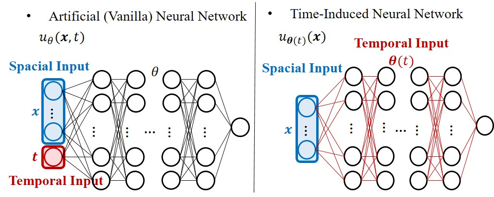

### It is the official implementation of TINNs

### 📄 Paper
- [TINNs in arXiv](https://arxiv.org/abs/2601.20361)

#### Time-Induced Neural Networks (TINNs) aims to solve various time-dependent partial differential equations (PDEs). It  parameterizes the network weights as a learned function of time, allowing the effective spatial representation to evolve over time while maintaining shared structure.

#### TINNs on benchmark time-dependent PDEs, showing improved accuracy and stability over other baselines.

